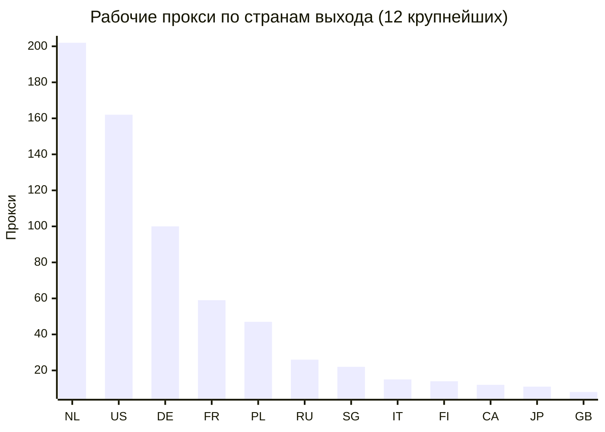
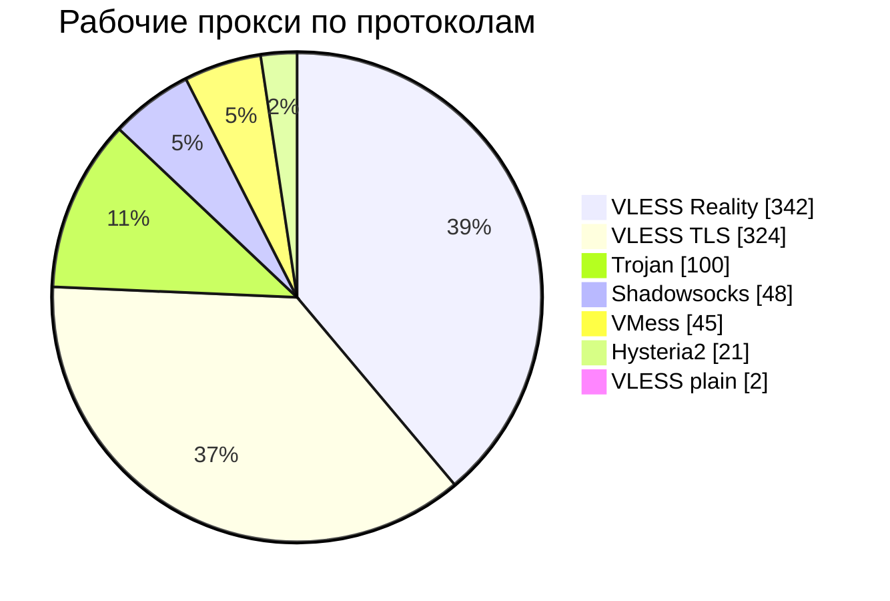
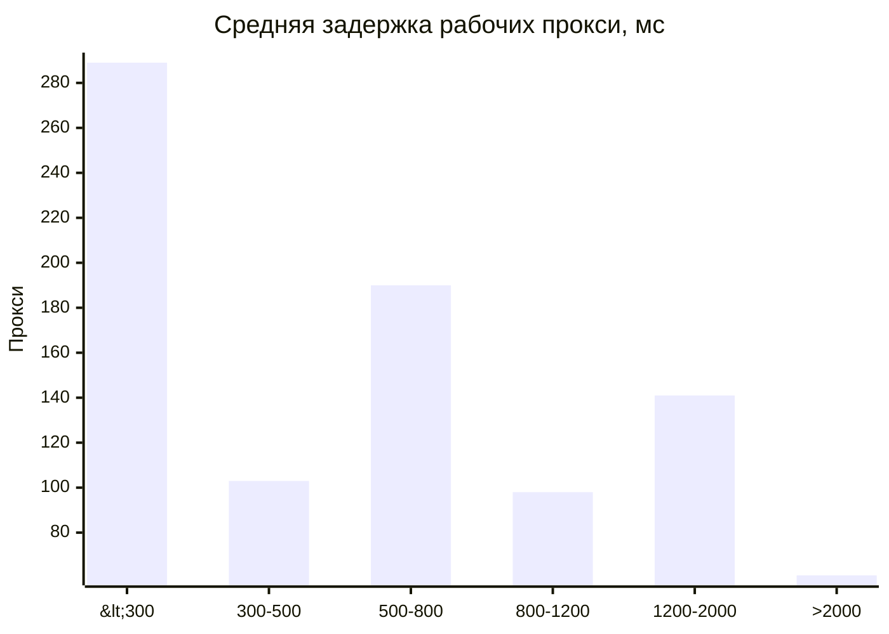

# Бесплатные VPN-подписки, проверенные из России

Прокси VLESS, VMess, Trojan, Shadowsocks и Hysteria2 из публичных подписок (источников: 91).
Раз в 6 ч все они проверяются с сервера в России через Xray-core, и сюда попадают только рабочие,
отсортированные от лучших к худшим: сначала по стабильности, затем по задержке.

Обновлено: 2026-11-09 21:34 UTC.

## Подписки

| Список | Прокси | Ссылка на подписку |
|---|---:|---|
| Топ 100 Европа | 100 | `https://raw.githubusercontent.com/rvvg/proxy-subs/main/subs/top100.txt` |
| Топ 100 Европа: автопереключение (JSON) | 94 | `https://raw.githubusercontent.com/rvvg/proxy-subs/main/subs/top100.json` |
| Все рабочие | 882 | `https://raw.githubusercontent.com/rvvg/proxy-subs/main/subs/all.txt` |
| Европа | 539 | `https://raw.githubusercontent.com/rvvg/proxy-subs/main/subs/continents/europe.txt` |
| Северная Америка | 176 | `https://raw.githubusercontent.com/rvvg/proxy-subs/main/subs/continents/north-america.txt` |
| Азия | 72 | `https://raw.githubusercontent.com/rvvg/proxy-subs/main/subs/continents/asia.txt` |
| Южная Америка | 7 | `https://raw.githubusercontent.com/rvvg/proxy-subs/main/subs/continents/south-america.txt` |
| Африка | 5 | `https://raw.githubusercontent.com/rvvg/proxy-subs/main/subs/continents/africa.txt` |
| Океания | 4 | `https://raw.githubusercontent.com/rvvg/proxy-subs/main/subs/continents/oceania.txt` |

Скопируйте ссылку и добавьте её в клиент как подписку: v2rayN, v2rayNG, Happ, INCY, Hiddify, Throne,
NekoBox, Streisand. Клиент сам будет обновлять список.

- `top100.txt` — до 100 лучших прокси с выходом в Европе (без России, Беларуси и Турции), все на разных
  серверах: не больше двух на один аккаунт и десяти на одного хостинг-провайдера, поэтому падение одного
  сервера или провайдера не выключает весь список. Начните с него.
- `top100.json` — те же прокси с автопереключением, см. ниже.
- `all.txt` — все рабочие прокси.
- Списки по континентам и странам — если нужен выход в определённом месте.

## Автоматический выбор и переключение сервера

**Happ.** Во всех списках включены настройки подписки Happ: при открытии приложение само проверяет
задержку каждого сервера, сортирует их по пингу и подключается к самому быстрому. INCY таких настроек
не поддерживает: в нём выберите «Авто» из JSON-подписки или отсортируйте серверы по пингу вручную.

**Happ, INCY, Streisand, v2rayN, V2Box, FoXray** понимают подписку в формате JSON (`top100.json`).
Первый пункт в ней — «Авто» (в INCY он называется «Авто-01 ...»): это пул из 15 лучших серверов у разных
провайдеров. Xray внутри приложения раз в 2 минуты проверяет их и сам переключается на самый быстрый из
работающих, в том числе во время работы, если текущий сервер перестал отвечать. Остальные пункты —
отдельные серверы для ручного выбора.
В JSON-подписку не входят Hysteria2 и серверы с отключённой проверкой сертификата: их не поддерживают
старые версии ядра в некоторых клиентах.

**Hiddify и другие клиенты на sing-box** сами создают группу автоматического выбора для любой подписки:
подойдёт обычный `top100.txt`.

Если `raw.githubusercontent.com` не открывается, используйте зеркало (обновляется с задержкой до 12 часов): `https://cdn.jsdelivr.net/gh/rvvg/proxy-subs@main/subs/top100.txt`

<details>
<summary>Списки по странам выхода</summary>

| Страна | Прокси | Ссылка на подписку |
|---|---:|---|
| NL | 202 | `https://raw.githubusercontent.com/rvvg/proxy-subs/main/subs/countries/nl.txt` |
| US | 162 | `https://raw.githubusercontent.com/rvvg/proxy-subs/main/subs/countries/us.txt` |
| DE | 100 | `https://raw.githubusercontent.com/rvvg/proxy-subs/main/subs/countries/de.txt` |
| FR | 59 | `https://raw.githubusercontent.com/rvvg/proxy-subs/main/subs/countries/fr.txt` |
| PL | 47 | `https://raw.githubusercontent.com/rvvg/proxy-subs/main/subs/countries/pl.txt` |
| RU | 26 | `https://raw.githubusercontent.com/rvvg/proxy-subs/main/subs/countries/ru.txt` |
| SG | 22 | `https://raw.githubusercontent.com/rvvg/proxy-subs/main/subs/countries/sg.txt` |
| IT | 15 | `https://raw.githubusercontent.com/rvvg/proxy-subs/main/subs/countries/it.txt` |
| FI | 14 | `https://raw.githubusercontent.com/rvvg/proxy-subs/main/subs/countries/fi.txt` |
| CA | 12 | `https://raw.githubusercontent.com/rvvg/proxy-subs/main/subs/countries/ca.txt` |
| JP | 11 | `https://raw.githubusercontent.com/rvvg/proxy-subs/main/subs/countries/jp.txt` |
| GB | 8 | `https://raw.githubusercontent.com/rvvg/proxy-subs/main/subs/countries/gb.txt` |
| CH | 8 | `https://raw.githubusercontent.com/rvvg/proxy-subs/main/subs/countries/ch.txt` |
| SE | 8 | `https://raw.githubusercontent.com/rvvg/proxy-subs/main/subs/countries/se.txt` |
| BY | 8 | `https://raw.githubusercontent.com/rvvg/proxy-subs/main/subs/countries/by.txt` |
| IN | 8 | `https://raw.githubusercontent.com/rvvg/proxy-subs/main/subs/countries/in.txt` |
| ES | 6 | `https://raw.githubusercontent.com/rvvg/proxy-subs/main/subs/countries/es.txt` |
| HK | 6 | `https://raw.githubusercontent.com/rvvg/proxy-subs/main/subs/countries/hk.txt` |
| DK | 4 | `https://raw.githubusercontent.com/rvvg/proxy-subs/main/subs/countries/dk.txt` |
| EE | 4 | `https://raw.githubusercontent.com/rvvg/proxy-subs/main/subs/countries/ee.txt` |
| AT | 4 | `https://raw.githubusercontent.com/rvvg/proxy-subs/main/subs/countries/at.txt` |
| GR | 4 | `https://raw.githubusercontent.com/rvvg/proxy-subs/main/subs/countries/gr.txt` |
| KZ | 4 | `https://raw.githubusercontent.com/rvvg/proxy-subs/main/subs/countries/kz.txt` |
| AU | 4 | `https://raw.githubusercontent.com/rvvg/proxy-subs/main/subs/countries/au.txt` |
| KR | 4 | `https://raw.githubusercontent.com/rvvg/proxy-subs/main/subs/countries/kr.txt` |
| HU | 3 | `https://raw.githubusercontent.com/rvvg/proxy-subs/main/subs/countries/hu.txt` |
| LV | 3 | `https://raw.githubusercontent.com/rvvg/proxy-subs/main/subs/countries/lv.txt` |
| AL | 3 | `https://raw.githubusercontent.com/rvvg/proxy-subs/main/subs/countries/al.txt` |
| TR | 3 | `https://raw.githubusercontent.com/rvvg/proxy-subs/main/subs/countries/tr.txt` |
| AZ | 3 | `https://raw.githubusercontent.com/rvvg/proxy-subs/main/subs/countries/az.txt` |
| BR | 3 | `https://raw.githubusercontent.com/rvvg/proxy-subs/main/subs/countries/br.txt` |
| AE | 3 | `https://raw.githubusercontent.com/rvvg/proxy-subs/main/subs/countries/ae.txt` |
| EG | 2 | `https://raw.githubusercontent.com/rvvg/proxy-subs/main/subs/countries/eg.txt` |
| MX | 2 | `https://raw.githubusercontent.com/rvvg/proxy-subs/main/subs/countries/mx.txt` |
| CO | 2 | `https://raw.githubusercontent.com/rvvg/proxy-subs/main/subs/countries/co.txt` |
| NG | 2 | `https://raw.githubusercontent.com/rvvg/proxy-subs/main/subs/countries/ng.txt` |
| BD | 2 | `https://raw.githubusercontent.com/rvvg/proxy-subs/main/subs/countries/bd.txt` |
| PK | 2 | `https://raw.githubusercontent.com/rvvg/proxy-subs/main/subs/countries/pk.txt` |
| IE | 1 | `https://raw.githubusercontent.com/rvvg/proxy-subs/main/subs/countries/ie.txt` |
| LT | 1 | `https://raw.githubusercontent.com/rvvg/proxy-subs/main/subs/countries/lt.txt` |
| HR | 1 | `https://raw.githubusercontent.com/rvvg/proxy-subs/main/subs/countries/hr.txt` |
| RS | 1 | `https://raw.githubusercontent.com/rvvg/proxy-subs/main/subs/countries/rs.txt` |
| RO | 1 | `https://raw.githubusercontent.com/rvvg/proxy-subs/main/subs/countries/ro.txt` |
| SI | 1 | `https://raw.githubusercontent.com/rvvg/proxy-subs/main/subs/countries/si.txt` |
| BE | 1 | `https://raw.githubusercontent.com/rvvg/proxy-subs/main/subs/countries/be.txt` |
| BG | 1 | `https://raw.githubusercontent.com/rvvg/proxy-subs/main/subs/countries/bg.txt` |
| IL | 1 | `https://raw.githubusercontent.com/rvvg/proxy-subs/main/subs/countries/il.txt` |
| MD | 1 | `https://raw.githubusercontent.com/rvvg/proxy-subs/main/subs/countries/md.txt` |
| CZ | 1 | `https://raw.githubusercontent.com/rvvg/proxy-subs/main/subs/countries/cz.txt` |
| TW | 1 | `https://raw.githubusercontent.com/rvvg/proxy-subs/main/subs/countries/tw.txt` |
| ZA | 1 | `https://raw.githubusercontent.com/rvvg/proxy-subs/main/subs/countries/za.txt` |
| MK | 1 | `https://raw.githubusercontent.com/rvvg/proxy-subs/main/subs/countries/mk.txt` |
| BH | 1 | `https://raw.githubusercontent.com/rvvg/proxy-subs/main/subs/countries/bh.txt` |
| AR | 1 | `https://raw.githubusercontent.com/rvvg/proxy-subs/main/subs/countries/ar.txt` |
| KH | 1 | `https://raw.githubusercontent.com/rvvg/proxy-subs/main/subs/countries/kh.txt` |
| CL | 1 | `https://raw.githubusercontent.com/rvvg/proxy-subs/main/subs/countries/cl.txt` |
| NO | 1 | `https://raw.githubusercontent.com/rvvg/proxy-subs/main/subs/countries/no.txt` |
| CY | 1 | `https://raw.githubusercontent.com/rvvg/proxy-subs/main/subs/countries/cy.txt` |

</details>

## Статистика последней проверки

| | |
|---|---:|
| Подписок-источников | 91 (недоступно: 2) |
| Скачано ссылок | 291,977 |
| Неподдерживаемые протоколы (socks, http, tuic и др.) | 6,513 |
| Дубликаты | 170,456 |
| Уникальные прокси | 115,008 |
| Битые ссылки | 33,775 |
| Не работали, ждут перепроверки | 5,769 |
| Не работают давно, больше не проверяются | 73,492 |
| Проверено сейчас | 1,972 |
| Не работают | 1,036 (52.5%) |
| Работают, но медленные для своей страны | 54 |
| **Рабочие, опубликованы** | **882** (44.7%) |
| Стран выхода | 58 |
| Медианная задержка опубликованных | 578 мс |
| Работают 24 часа и дольше | 305 |

Прокси, которые не работают, перепроверяются раз в 3 дня; если прокси не работает и через 3 дня после
первой неудачи, он больше не проверяется. Дубликаты — один и тот же сервер, опубликованный в разных
подписках под разными именами.

## Графики


```mermaid
xychart-beta
    title "Рабочие прокси по проверкам"
    x-axis ["11-02 21:17", "11-03 03:17", "11-03 09:17", "11-03 15:17", "11-03 17:48", "11-03 21:17", "11-04 03:17", "11-04 09:17", "11-04 15:17", "11-04 21:17", "11-05 03:17", "11-05 09:17", "11-05 15:17", "11-05 21:17", "11-06 03:17", "11-06 09:17", "11-06 15:17", "11-06 21:17", "11-07 03:17", "11-07 09:17", "11-07 15:17", "11-07 21:17", "11-08 03:17", "11-08 09:17", "11-08 15:17", "11-08 21:17", "11-09 03:17", "11-09 09:17", "11-09 15:17", "11-09 21:17"]
    y-axis "Прокси"
    line [1136, 1217, 1132, 1246, 22, 1316, 1520, 1043, 844, 832, 1041, 883, 631, 546, 962, 563, 523, 694, 792, 625, 611, 690, 870, 741, 711, 911, 1206, 1007, 890, 882]
```


```mermaid
xychart-beta
    title "Рабочие прокси по странам выхода (12 крупнейших)"
    x-axis ["NL", "US", "DE", "FR", "PL", "RU", "SG", "IT", "FI", "CA", "JP", "GB"]
    y-axis "Прокси"
    bar [202, 162, 100, 59, 47, 26, 22, 15, 14, 12, 11, 8]
```


```mermaid
pie showData
    title Рабочие прокси по протоколам
    "VLESS Reality" : 342
    "VLESS TLS" : 324
    "Trojan" : 100
    "Shadowsocks" : 48
    "VMess" : 45
    "Hysteria2" : 21
    "VLESS plain" : 2
```


```mermaid
xychart-beta
    title "Средняя задержка рабочих прокси, мс"
    x-axis ["<300", "300-500", "500-800", "800-1200", "1200-2000", ">2000"]
    y-axis "Прокси"
    bar [289, 103, 190, 98, 141, 61]
```

## Пул для Xray

Конфиг Xray с пулом лучших прокси на разных провайдерах: Xray сам проверяет их и переключается на самый
быстрый из работающих. Ссылка: `https://raw.githubusercontent.com/rvvg/proxy-subs/main/subs/pool.json`

```sh
xray run -c pool.json        # SOCKS 127.0.0.1:10808, HTTP 127.0.0.1:10809
```

## Важно

Это бесплатные прокси неизвестных владельцев. Владелец сервера может видеть ваш трафик, а сервер может
перестать работать в любой момент. Не используйте их для банков и важных аккаунтов. Списки собираются
автоматически; за содержимое исходных подписок отвечают их авторы.
