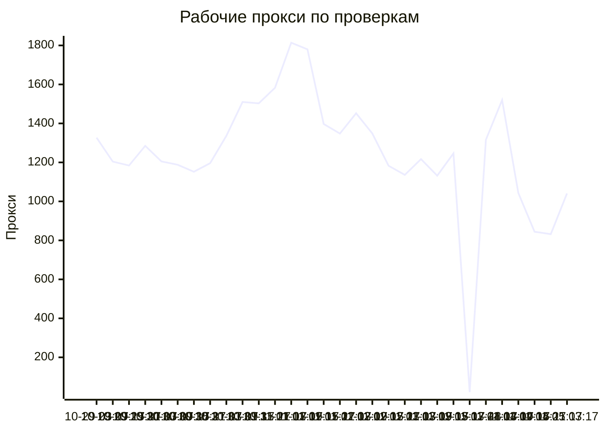
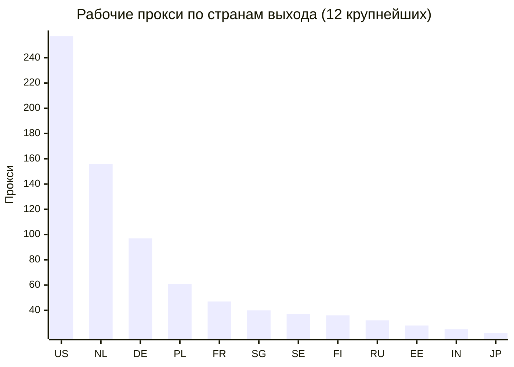
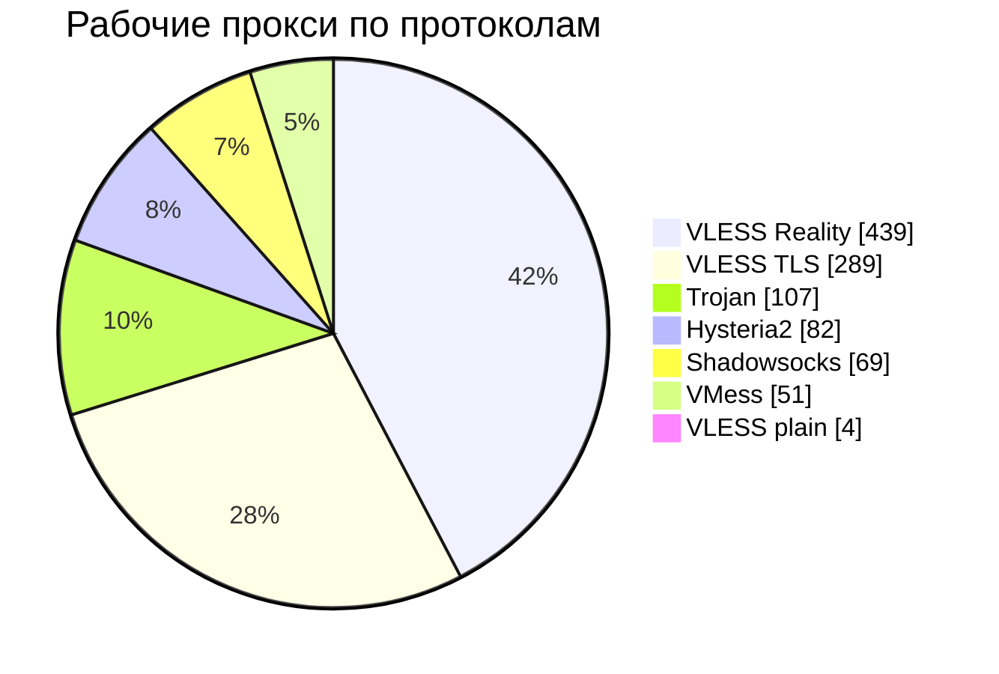
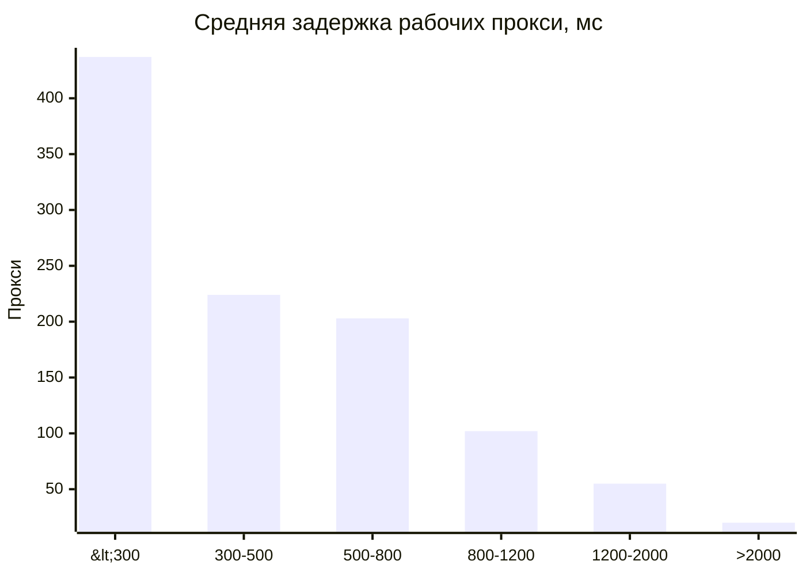

# Бесплатные VPN-подписки, проверенные из России

Прокси VLESS, VMess, Trojan, Shadowsocks и Hysteria2 из публичных подписок (источников: 91).
Раз в 6 ч все они проверяются с сервера в России через Xray-core, и сюда попадают только рабочие,
отсортированные от лучших к худшим: сначала по стабильности, затем по задержке.

Обновлено: 2026-11-05 03:33 UTC.

## Подписки

| Список | Прокси | Ссылка на подписку |
|---|---:|---|
| Топ 100 Европа | 100 | `https://raw.githubusercontent.com/rvvg/proxy-subs/main/subs/top100.txt` |
| Топ 100 Европа: автопереключение (JSON) | 89 | `https://raw.githubusercontent.com/rvvg/proxy-subs/main/subs/top100.json` |
| Все рабочие | 1,041 | `https://raw.githubusercontent.com/rvvg/proxy-subs/main/subs/all.txt` |
| Европа | 586 | `https://raw.githubusercontent.com/rvvg/proxy-subs/main/subs/continents/europe.txt` |
| Северная Америка | 270 | `https://raw.githubusercontent.com/rvvg/proxy-subs/main/subs/continents/north-america.txt` |
| Азия | 114 | `https://raw.githubusercontent.com/rvvg/proxy-subs/main/subs/continents/asia.txt` |
| Южная Америка | 3 | `https://raw.githubusercontent.com/rvvg/proxy-subs/main/subs/continents/south-america.txt` |
| Африка | 1 | `https://raw.githubusercontent.com/rvvg/proxy-subs/main/subs/continents/africa.txt` |
| Океания | 1 | `https://raw.githubusercontent.com/rvvg/proxy-subs/main/subs/continents/oceania.txt` |

Скопируйте ссылку и добавьте её в клиент как подписку: v2rayN, v2rayNG, Happ, INCY, Hiddify, Throne,
NekoBox, Streisand. Клиент сам будет обновлять список.

- `top100.txt` — до 100 лучших прокси с выходом в Европе (без России, Беларуси и Турции), все на разных
  серверах: не больше двух на один аккаунт и десяти на одного хостинг-провайдера, поэтому падение одного
  сервера или провайдера не выключает весь список. Начните с него.
- `top100.json` — те же прокси с автопереключением, см. ниже.
- `all.txt` — все рабочие прокси.
- Списки по континентам и странам — если нужен выход в определённом месте.

## Автоматический выбор и переключение сервера

**Happ.** Во всех списках включены настройки подписки Happ: при открытии приложение само проверяет
задержку каждого сервера, сортирует их по пингу и подключается к самому быстрому. INCY таких настроек
не поддерживает: в нём выберите «Авто» из JSON-подписки или отсортируйте серверы по пингу вручную.

**Happ, INCY, Streisand, v2rayN, V2Box, FoXray** понимают подписку в формате JSON (`top100.json`).
Первый пункт в ней — «Авто» (в INCY он называется «Авто-01 ...»): это пул из 15 лучших серверов у разных
провайдеров. Xray внутри приложения раз в 2 минуты проверяет их и сам переключается на самый быстрый из
работающих, в том числе во время работы, если текущий сервер перестал отвечать. Остальные пункты —
отдельные серверы для ручного выбора.
В JSON-подписку не входят Hysteria2 и серверы с отключённой проверкой сертификата: их не поддерживают
старые версии ядра в некоторых клиентах.

**Hiddify и другие клиенты на sing-box** сами создают группу автоматического выбора для любой подписки:
подойдёт обычный `top100.txt`.

Если `raw.githubusercontent.com` не открывается, используйте зеркало (обновляется с задержкой до 12 часов): `https://cdn.jsdelivr.net/gh/rvvg/proxy-subs@main/subs/top100.txt`

<details>
<summary>Списки по странам выхода</summary>

| Страна | Прокси | Ссылка на подписку |
|---|---:|---|
| US | 257 | `https://raw.githubusercontent.com/rvvg/proxy-subs/main/subs/countries/us.txt` |
| NL | 156 | `https://raw.githubusercontent.com/rvvg/proxy-subs/main/subs/countries/nl.txt` |
| DE | 97 | `https://raw.githubusercontent.com/rvvg/proxy-subs/main/subs/countries/de.txt` |
| PL | 61 | `https://raw.githubusercontent.com/rvvg/proxy-subs/main/subs/countries/pl.txt` |
| FR | 47 | `https://raw.githubusercontent.com/rvvg/proxy-subs/main/subs/countries/fr.txt` |
| SG | 40 | `https://raw.githubusercontent.com/rvvg/proxy-subs/main/subs/countries/sg.txt` |
| SE | 37 | `https://raw.githubusercontent.com/rvvg/proxy-subs/main/subs/countries/se.txt` |
| FI | 36 | `https://raw.githubusercontent.com/rvvg/proxy-subs/main/subs/countries/fi.txt` |
| RU | 32 | `https://raw.githubusercontent.com/rvvg/proxy-subs/main/subs/countries/ru.txt` |
| EE | 28 | `https://raw.githubusercontent.com/rvvg/proxy-subs/main/subs/countries/ee.txt` |
| IN | 25 | `https://raw.githubusercontent.com/rvvg/proxy-subs/main/subs/countries/in.txt` |
| JP | 22 | `https://raw.githubusercontent.com/rvvg/proxy-subs/main/subs/countries/jp.txt` |
| IT | 17 | `https://raw.githubusercontent.com/rvvg/proxy-subs/main/subs/countries/it.txt` |
| GB | 17 | `https://raw.githubusercontent.com/rvvg/proxy-subs/main/subs/countries/gb.txt` |
| CA | 13 | `https://raw.githubusercontent.com/rvvg/proxy-subs/main/subs/countries/ca.txt` |
| HK | 12 | `https://raw.githubusercontent.com/rvvg/proxy-subs/main/subs/countries/hk.txt` |
| ES | 10 | `https://raw.githubusercontent.com/rvvg/proxy-subs/main/subs/countries/es.txt` |
| BY | 8 | `https://raw.githubusercontent.com/rvvg/proxy-subs/main/subs/countries/by.txt` |
| RS | 8 | `https://raw.githubusercontent.com/rvvg/proxy-subs/main/subs/countries/rs.txt` |
| TR | 6 | `https://raw.githubusercontent.com/rvvg/proxy-subs/main/subs/countries/tr.txt` |
| CZ | 6 | `https://raw.githubusercontent.com/rvvg/proxy-subs/main/subs/countries/cz.txt` |
| DK | 4 | `https://raw.githubusercontent.com/rvvg/proxy-subs/main/subs/countries/dk.txt` |
| IE | 4 | `https://raw.githubusercontent.com/rvvg/proxy-subs/main/subs/countries/ie.txt` |
| CH | 4 | `https://raw.githubusercontent.com/rvvg/proxy-subs/main/subs/countries/ch.txt` |
| AT | 4 | `https://raw.githubusercontent.com/rvvg/proxy-subs/main/subs/countries/at.txt` |
| LT | 3 | `https://raw.githubusercontent.com/rvvg/proxy-subs/main/subs/countries/lt.txt` |
| NO | 3 | `https://raw.githubusercontent.com/rvvg/proxy-subs/main/subs/countries/no.txt` |
| KZ | 3 | `https://raw.githubusercontent.com/rvvg/proxy-subs/main/subs/countries/kz.txt` |
| BR | 3 | `https://raw.githubusercontent.com/rvvg/proxy-subs/main/subs/countries/br.txt` |
| AL | 2 | `https://raw.githubusercontent.com/rvvg/proxy-subs/main/subs/countries/al.txt` |
| MD | 2 | `https://raw.githubusercontent.com/rvvg/proxy-subs/main/subs/countries/md.txt` |
| TW | 2 | `https://raw.githubusercontent.com/rvvg/proxy-subs/main/subs/countries/tw.txt` |
| AM | 1 | `https://raw.githubusercontent.com/rvvg/proxy-subs/main/subs/countries/am.txt` |
| EG | 1 | `https://raw.githubusercontent.com/rvvg/proxy-subs/main/subs/countries/eg.txt` |
| AU | 1 | `https://raw.githubusercontent.com/rvvg/proxy-subs/main/subs/countries/au.txt` |
| AE | 1 | `https://raw.githubusercontent.com/rvvg/proxy-subs/main/subs/countries/ae.txt` |
| SA | 1 | `https://raw.githubusercontent.com/rvvg/proxy-subs/main/subs/countries/sa.txt` |
| QA | 1 | `https://raw.githubusercontent.com/rvvg/proxy-subs/main/subs/countries/qa.txt` |

</details>

## Статистика последней проверки

| | |
|---|---:|
| Подписок-источников | 91 (недоступно: 2) |
| Скачано ссылок | 302,631 |
| Неподдерживаемые протоколы (socks, http, tuic и др.) | 6,888 |
| Дубликаты | 178,735 |
| Уникальные прокси | 117,008 |
| Битые ссылки | 36,056 |
| Не работали, ждут перепроверки | 5,679 |
| Не работают давно, больше не проверяются | 73,009 |
| Проверено сейчас | 2,264 |
| Не работают | 1,155 (51.0%) |
| Работают, но медленные для своей страны | 68 |
| **Рабочие, опубликованы** | **1,041** (46.0%) |
| Стран выхода | 38 |
| Медианная задержка опубликованных | 363 мс |
| Работают 24 часа и дольше | 435 |

Прокси, которые не работают, перепроверяются раз в 3 дня; если прокси не работает и через 3 дня после
первой неудачи, он больше не проверяется. Дубликаты — один и тот же сервер, опубликованный в разных
подписках под разными именами.

## Графики


```mermaid
xychart-beta
    title "Рабочие прокси по проверкам"
    x-axis ["10-29 03:17", "10-29 09:17", "10-29 15:17", "10-29 21:17", "10-30 03:17", "10-30 09:17", "10-30 15:17", "10-30 21:17", "10-31 03:17", "10-31 09:17", "10-31 15:17", "10-31 21:17", "11-01 03:17", "11-01 09:17", "11-01 15:17", "11-01 21:17", "11-02 03:17", "11-02 09:17", "11-02 15:17", "11-02 21:17", "11-03 03:17", "11-03 09:17", "11-03 15:17", "11-03 17:48", "11-03 21:17", "11-04 03:17", "11-04 09:17", "11-04 15:17", "11-04 21:17", "11-05 03:17"]
    y-axis "Прокси"
    line [1327, 1204, 1184, 1285, 1205, 1188, 1152, 1196, 1336, 1510, 1503, 1583, 1814, 1780, 1397, 1348, 1452, 1348, 1183, 1136, 1217, 1132, 1246, 22, 1316, 1520, 1043, 844, 832, 1041]
```


```mermaid
xychart-beta
    title "Рабочие прокси по странам выхода (12 крупнейших)"
    x-axis ["US", "NL", "DE", "PL", "FR", "SG", "SE", "FI", "RU", "EE", "IN", "JP"]
    y-axis "Прокси"
    bar [257, 156, 97, 61, 47, 40, 37, 36, 32, 28, 25, 22]
```


```mermaid
pie showData
    title Рабочие прокси по протоколам
    "VLESS Reality" : 439
    "VLESS TLS" : 289
    "Trojan" : 107
    "Hysteria2" : 82
    "Shadowsocks" : 69
    "VMess" : 51
    "VLESS plain" : 4
```


```mermaid
xychart-beta
    title "Средняя задержка рабочих прокси, мс"
    x-axis ["<300", "300-500", "500-800", "800-1200", "1200-2000", ">2000"]
    y-axis "Прокси"
    bar [437, 224, 203, 102, 55, 20]
```

## Пул для Xray

Конфиг Xray с пулом лучших прокси на разных провайдерах: Xray сам проверяет их и переключается на самый
быстрый из работающих. Ссылка: `https://raw.githubusercontent.com/rvvg/proxy-subs/main/subs/pool.json`

```sh
xray run -c pool.json        # SOCKS 127.0.0.1:10808, HTTP 127.0.0.1:10809
```

## Важно

Это бесплатные прокси неизвестных владельцев. Владелец сервера может видеть ваш трафик, а сервер может
перестать работать в любой момент. Не используйте их для банков и важных аккаунтов. Списки собираются
автоматически; за содержимое исходных подписок отвечают их авторы.
